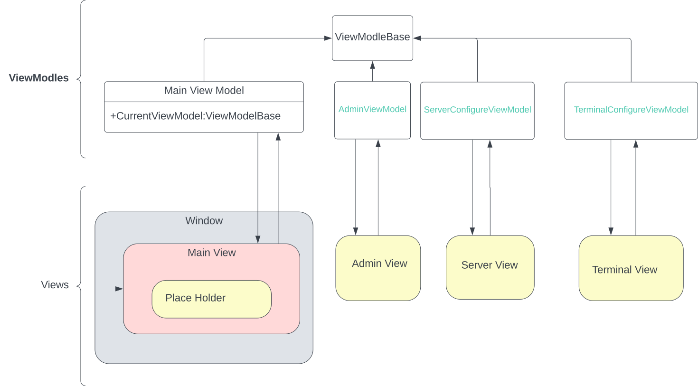

# Navigation Sample
This is an Example of how to achieve navigation in [avalonia ui][2] to elaborate more on [stack overflow question][1]

## Output


## How To Run
it Require .NET7 ... to run the `NavigationApp.Desktop`
```cmd
cd ./NavigationApp.Desktop
dotnet run
```

## Technologies
- .NET 7
- avalonia UI V11.0.5
- Community ToolKit 

## Explanation
your problem is a navigation problem ... and there is a different solution to solve this but simple thing should be simple

for each screen you need View and ViewModel To suport this screen
```
/root
├── ViewModels
│   ├── TerminalConfigureViewModel
│   ├── ServerConfigureViewModel
│   └── AdminViewModel
│
├── Views
│   ├── TerminalConfigureView
│   ├── ServerConfigureView
│   └── AdminView
```

Now we need to tell avaloniat that if you try to rander one of the Viewmodels How to choos the correct view (By help of [data templates][3])

```xml
<Application.DataTemplates>
   <DataTemplate DataType="{x:Type vm:ServerConfigureViewModel}">
     <view:ServerConfigureView/>      
   </DataTemplate>

   <DataTemplate DataType="{x:Type vm:TerminalConfigureViewModel}">
     <view:TerminalConfigureView/>
   </DataTemplate>

   <DataTemplate DataType="{x:Type vm:AdminViewModel}">
     <view:AdminView/>
   </DataTemplate>
 </Application.DataTemplates>
```

or the more Easy Solution to Depend on the naming convention. if you want rander this `ViewModels.{name}ViewModel` Use this view `Views.{name}View` (Read about [ViewLocator][4])

in the `MainViewModel` We also have property called `CurrentViewModel` which is randered to the MainView if you change this property avalonia know how to rander it


### Summary 


[1]: https://stackoverflow.com/questions/77497337/why-is-my-usercontrol-not-being-loaded-in-my-mainwindow/77497651?noredirect=1#comment136632850_77497651

[2]: https://avaloniaui.net/

[3]: https://docs.avaloniaui.net/docs/templates/data-templates

[4]: https://docs.avaloniaui.net/docs/next/concepts/view-locator